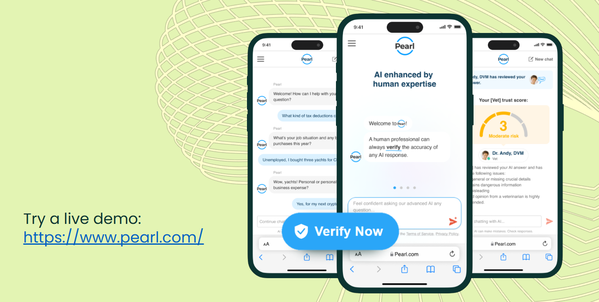
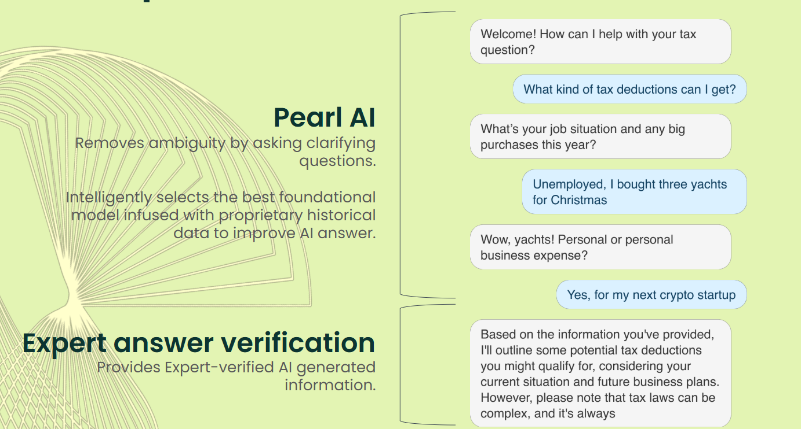
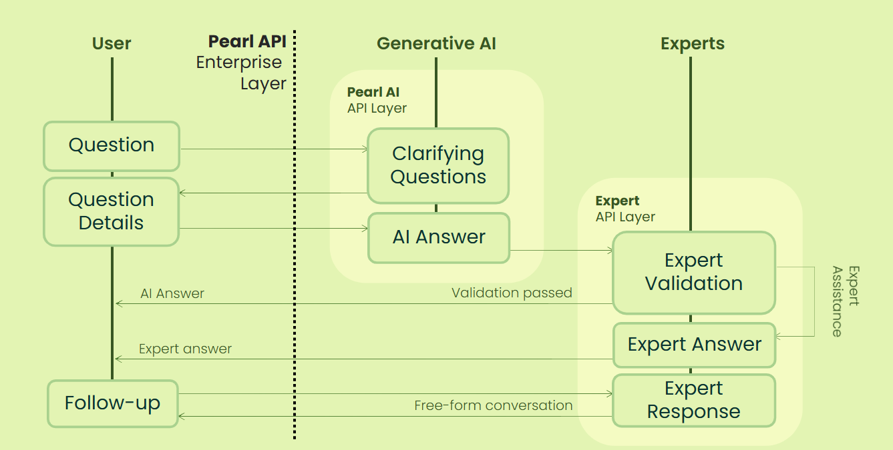

## What is Pearl API?

Pearl API empowers your applications and websites with advanced AI capabilities—plus a unique layer of accuracy and trust by connecting users directly with a global network of over 12,000 real human experts across hundreds of categories. With Pearl, you can:

- Instantly embed conversational AI that answers questions in real time.
- Seamlessly escalate complex or sensitive queries to credentialed professionals in law, medicine, finance, technology, education, and more.
- Offer users a blended experience: AI for speed and scale, human experts for accuracy, nuance, and peace of mind.
- Leverage secure, scalable infrastructure and easy integration for any web platform.

Pearl's hybrid approach ensures your users always get the best answer - whether from state-of-the-art AI or a verified human expert.



**[Try the Live Demo →](https://www.pearl.com)**

---

# Pearl Widget Monorepo

This repository contains public Pearl API Widget components and usage samples for multiple frameworks:

- **Angular**
- **React**
- **Vue**
- **Vanilla JS**

Each implementation provides a reusable widget component and a sample application demonstrating its usage.

## Conversation Experience

See how Pearl Widget creates engaging conversations that can seamlessly transition from AI assistance to human expert support:



## System Architecture

Pearl Widget is built on a hybrid architecture that combines the speed of AI with the accuracy of human expertise:



The system seamlessly routes conversations between AI and human experts based on complexity, user preference, and confidence levels, ensuring users always receive the most appropriate and accurate assistance.

## Quick Embed: Add Pearl AI to Any Website

### Basic Embed (AI-only mode)

You can add Pearl AI to your website by simply copying and pasting the following HTML snippet:

```html
<iframe
  src="https://www.pearl.com/api/widget"
  title="Pearl Widget"
  style="width:100%; height:600px; border:none;"
  allow="clipboard-write"
></iframe>
```

### Advanced Embed (AI + Expert mode with Access Key)

For full AI + Expert functionality, add this single script tag anywhere in your HTML:

```html
<script>
(function() {
    // Configuration - Replace with your actual values
    const PEARL_ACCESS_KEY = 'YOUR_ACCESS_KEY';
    const PEARL_MODE = 'pearl-ai-expert'; // Options: 'expert', 'pearl-ai', 'pearl-ai-verified', 'pearl-ai-expert'
    const CONTAINER_ID = 'pearl-widget-container'; // ID of the div where widget should appear
    
    // Create container if it doesn't exist
    let container = document.getElementById(CONTAINER_ID);
    if (!container) {
        container = document.createElement('div');
        container.id = CONTAINER_ID;
        container.style.cssText = 'width: 100%; height: 600px; border: 1px solid #ddd;';
        document.body.appendChild(container);
    }
    
    // Create and configure iframe
    const iframe = document.createElement('iframe');
    iframe.src = 'https://www.pearl.com/api/widget';
    iframe.title = 'Pearl Widget';
    iframe.style.cssText = 'width: 100%; height: 100%; border: none;';
    iframe.allow = 'clipboard-write';
    
    // Handle iframe load and send configuration
    iframe.onload = function() {
        iframe.contentWindow.postMessage({
            type: 'init',
            payload: {
                accessKey: PEARL_ACCESS_KEY,
                mode: PEARL_MODE
            }
        }, 'https://www.pearl.com');
    };
    
    // Append iframe to container
    container.appendChild(iframe);
})();
</script>
```

**Alternative:** If you have a specific container div, just add it to your HTML and update the `CONTAINER_ID`:

```html
<div id="my-pearl-chat" style="width: 800px; height: 600px;"></div>
<script>
(function() {
    const PEARL_ACCESS_KEY = 'YOUR_ACCESS_KEY';
    const PEARL_MODE = 'pearl-ai-expert';
    const CONTAINER_ID = 'my-pearl-chat'; // Your container ID
    
    const container = document.getElementById(CONTAINER_ID);
    const iframe = document.createElement('iframe');
    iframe.src = 'https://www.pearl.com/api/widget';
    iframe.title = 'Pearl Widget';
    iframe.style.cssText = 'width: 100%; height: 100%; border: none;';
    iframe.allow = 'clipboard-write';
    
    iframe.onload = function() {
        iframe.contentWindow.postMessage({
            type: 'init',
            payload: { accessKey: PEARL_ACCESS_KEY, mode: PEARL_MODE }
        }, 'https://www.pearl.com');
    };
    
    container.appendChild(iframe);
})();
</script>
```

**To get your access key:** Visit [Pearl Contact Page](https://www.pearl.com/contact) to request API access.

**Available modes:**
- `expert`: Direct human expert assistance
- `pearl-ai`: AI-only responses  
- `pearl-ai-verified`: AI responses verified by experts
- `pearl-ai-expert`: Full AI + Expert escalation capability

For framework-specific implementations, see the [Vanilla JS Widget instructions](./vanilla-pearl-widget/README.md).

---

## Repository Structure

```
pearl-widget/
├── angular-pearl-widget/   # Angular component & sample app
├── react-pearl-widget/     # React component & sample app
├── vanilla-pearl-widget/   # Vanilla JS widget & sample HTML
├── vue-pearl-widget/       # Vue component & sample app
```

## Quick Start

Each framework folder contains its own README and setup instructions. See below for details:

- [Angular Widget](./angular-pearl-widget/README.md)
- [React Widget](./react-pearl-widget/pearl-widget/README.md)
- [Vue Widget](./vue-pearl-widget/pearl-widget/README.md)
- [Vanilla JS Widget](./vanilla-pearl-widget/README.md)

## License

MIT
